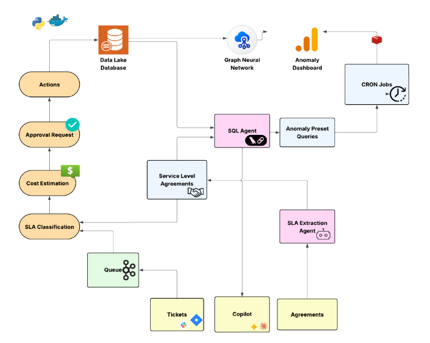

# SLA.ck

## SLA.ck: One Stop Agentic Business Sentry

SLA.ck by Team LinkedOut is an agentic operations platform for two related jobs:

- keeping ticket and approval workflows inside SLA and penalty guardrails
- connecting operational PostgreSQL sources, generating anomaly detectors, and exposing those sources through dashboards and copilot investigations

The system uses Agent-to-Agent (A2A) services for specialized reasoning, but keeps the main product loop in the FastAPI backend: connector setup, background artifact generation, detector persistence, copilot sessions, dashboard rendering, approval workflows, and audit trails.

## Our Product

SLA.ck AI is not a dashboarding layer placed on top of enterprise data. It is an agentic decision-support and execution system that converts fragmented operational, procurement, finance, and SLA signals into governed business actions.

The product is built around a continuous intelligence loop:

1. ingest enterprise data
2. normalize it into a canonical business shape
3. detect high-risk inefficiency patterns
4. estimate financial exposure with explicit formulas
5. recommend the next best intervention
6. route the intervention through approval policy
7. track the realized outcome through an auditable action trail

Most enterprise monitoring stacks stop at visibility. SLA.ck is designed as an operational control plane for cost leakage prevention. It combines source intelligence, anomaly detection, SLA intelligence, financial impact modeling, approval orchestration, and bounded autonomous execution into a single workflow. The result is a system that does not merely explain where money is being lost, but can initiate corrective workflows before the loss is booked.

## How the Solution Addresses the Problem

The platform operationalizes three enterprise outcomes at once:

- **Spend intelligence**: scans invoices, contracts, vendor records, reconciliations, and operational evidence for duplicate spend, rate drift, billing discrepancies, and waste patterns
- **SLA and penalty prevention**: extracts contractual obligations from documents, maps those obligations to live work items, and flags impending breach scenarios before penalties materialize
- **Governed autonomous action**: creates approval-aware actions such as payment review, vendor dispute initiation, workload rerouting, escalation, and capacity rebalancing

## Agentic Infrastructure

### A2A Protocol Implementation

SLA.ck implements a multi-agent architecture based on the **Agent-to-Agent (A2A)** protocol, enabling specialized agents to communicate and collaborate on complex operational tasks:

- Agents expose capabilities via `/agent-card` endpoints
- Communication uses JSON-RPC 2.0 messages via `/message/send`
- Graceful fallback mechanisms ensure continuous operation

### Agent Categories

SLA.ck deploys four distinct agent categories, each responsible for a specific domain of operational intelligence:

---

### Named Agent Roles

The product pitch maps cleanly onto the actual runtime components in this repo:

- **Source Intelligence Agent**: profiles schemas, inspects relation shapes, builds dataset memory, and generates reusable anomaly-query presets when a company connects relational sources
- **SQL Investigation Agent**: acts as the analytical copilot for operators and analysts, producing safe read-only SQL over the connected business schema for drilldown, variance analysis, and root-cause validation
- **SLA Extraction Agent**: ingests contracts, SOPs, PDFs, DOCX/text content, and document-derived evidence to produce structured SLA candidates that enter a review queue before activation
- **Detection and Case Generation Engine**: continuously scans normalized business data and turns risky patterns into evidence-backed cases, alerts, and detector outcomes
- **Approval and Action Orchestrator**: converts cases into approval-aware interventions, routes them through policy, and records state transitions for auditability

These roles are implemented through a mix of A2A agents, backend services, and reviewable deterministic fallbacks.

---

#### 1. Spend Intelligence Agents

These agents dig into **procurement, vendor, and operations data** to find anomalies, duplicate costs, and rate optimization opportunities—then generate actionable playbooks or trigger downstream workflows.

**SQL Agent** (`backend/app/a2a_apps/sql_agent.py`)

- **Data Source Analysis**: Connects to PostgreSQL databases to analyze schema and extract relation metadata (tables, views, materialized views)
- **Anomaly Detection Query Generation**: Automatically generates read-only SQL queries to detect:
  - Duplicate spend patterns
  - Rate mismatches between contracts and invoices
  - Vendor discrepancies and billing anomalies
- **Category Classification**: Categorizes data sources into:
  - `procurewatch` - Invoice, vendor, billing, procurement signals
  - `resource_optimization` - General resource utilization
- **Security**: Validates all generated SQL to ensure only read-only SELECT/WITH queries (prevents injection)
- **Copilot Question Answering**: Reuses the same SQL reasoning stack to answer plain-English investigation questions, produce checked SQL, execute it read-only, and stream the final result back to the UI

**Detector Engine** (`backend/app/services/detectors.py`, `backend/app/services/detector_runtime.py`)

- Executes AI-generated SQL queries on scheduled intervals
- Triggers alerts when anomaly thresholds are met
- Generates actionable playbooks with cost impact calculations

**Dashboard Agent** (`backend/app/a2a_apps/dashboard_agent.py`)

- **Dashboard Planning**: Takes connector memory, generated presets, and sampled query outputs to build dashboard specs
- **Multi-View Layout Generation**: Produces more than one dashboard surface, rather than a single text-heavy page
- **Binding-Aware Widgets**: Maps charts, lists, and tables onto supported bindings such as:
  - preset inventory
  - validation coverage
  - module-level detector counts
  - latest detector row volumes
  - sampled query result rows
- **SQL Sampling**: Can validate and sample generated preset queries directly from the connected source before producing the dashboard spec

**Code Flow**:
```
User connects data source → SQL Agent analyzes schema and generates presets →
Detector Engine persists generated detectors → Dashboard Agent generates dashboard spec →
Detector Engine schedules queries → Results trigger alerts → Action Recommendation Agent generates playbook
```

---

#### 2. Service Level Agreement (SLA) and Penalty Prevention Agents

These agents detect **approaching breaches from operational signals** and reroute work, shift resources, or escalate before the financial hit lands.

**Agentic Intake System** (`backend/app/services/agentic_intake.py`)

- **Intelligent Classification**: Uses NLP and heuristic analysis to classify incoming tickets:
  - Delivery issues vs. vendor disputes vs. support tickets
  - Priority detection (P1, P2, standard)
  - Customer tier identification
- **SLA Context Matching**: Matches tickets against extracted SLA contracts:
  - Parses PDF contracts to extract SLA terms
  - Matches ticket attributes (workflow type, priority, vendor) against SLA rules
  - Calculates time remaining and penalty exposure from contract terms
- **Risk Assessment**: Predicts breach probability based on:
  - Time remaining vs. SLA targets
  - Backlog hours and workload
  - Historical resolution patterns

**SLA Runtime Engine** (`backend/app/services/sla/runtime.py`)

- **Real-time SLA Tracking**: Monitors active workflows against SLA targets
- **Breach Prediction**: Calculates risk levels (low, medium, high, critical) based on time remaining
- **Penalty Calculation**: Computes penalty exposure directly from contract terms (not artificial multipliers)
- **Intervention Suggestions**: Recommends:
  - Queue rerouting
  - Resource shifting
  - Escalation triggers

**Code Flow**:
```
User creates ticket → Agentic Intake classifies ticket → SLA Runtime matches against contract rules →
Calculates time remaining and penalty → Predicted breach risk triggers alerts → 
Action Agent generates intervention playbook → Escalation or auto-action triggered
```

---

#### 3. Resource Optimization Agents

These agents monitor **utilization across tools, infrastructure, and teams**—recommending consolidation and executing approved changes.

**Connector Management** (`backend/app/services/connectors.py`)

- **Data Source Integration**: Connects to external PostgreSQL databases
- **Schema Introspection**: Extracts table structures, column types, and relationship metadata
- **Utilization Metrics**: Analyzes query patterns and result volumes

**Detector Presets** (generated by SQL Agent)

- Monitors resource utilization across connected data sources
- Identifies:
  - Underutilized infrastructure
  - Redundant processes
  - Cost optimization opportunities

---

#### 4. Financial Operations Agents

These agents **reconcile transactions, flag discrepancies, and produce variance analyses** with root-cause attribution to cut close cycles.

**Alert & Case Management** (`backend/app/services/alerts/`, `backend/app/services/cases.py`)

- **Anomaly Detection**: Monitors for:
  - Duplicate spend across vendors
  - Rate mismatches between contracts and invoices
  - Vendor discrepancies
- **Root Cause Attribution**: Links detected issues to:
  - Specific vendors
  - Departments
  - Contract terms

**Action Recommendation Agent** (`backend/app/services/agents.py` - Cerebras LangChain)

- **Playbook Generation**: Creates actionable recommendations from alerts:
  - Title and rationale
  - Specific action type (reroute_queue, open_review_task, etc.)
  - Step-by-step playbook
  - Expected savings ratio
  - Confidence score
- **Approval Workflow Integration**: Routes recommendations through enterprise approval chains

**Approval Suggestion Agent** (`backend/app/services/agents.py`)

- **Risk Assessment**: Evaluates action risk against configured guardrails
- **Auto-Approval**: Determines if actions can be auto-approved based on:
  - Risk level (low/medium actions from trusted agents)
  - Policy rules
  - Historical approval patterns

**Code Flow**:
```
Detector runs → Alert generated → Action Agent analyzes alert context → 
Generates playbook with expected savings → Approval Agent evaluates risk → 
Routes to appropriate approver → Approved action executed → Audit trail recorded
```

---

### Agent Communication Flow

```
┌─────────────────────────────────────────────────────────────────────────────┐
│                           User Creates Ticket                                │
└─────────────────────────────────┬───────────────────────────────────────────┘
                                  │
                                  ▼
┌─────────────────────────────────────────────────────────────────────────────┐
│                     Agentic Intake System                                    │
│  • Classifies ticket (delivery, vendor dispute, support)                    │
│  • Extracts SLA context from PDF contracts                                   │
│  • Calculates penalty exposure from contract terms                           │
└─────────────────────────────────┬───────────────────────────────────────────┘
                                  │
                                  ▼
┌─────────────────────────────────────────────────────────────────────────────┐
│                     SLA Runtime Engine                                       │
│  • Matches ticket against active SLA rules                                   │
│  • Calculates time remaining and breach risk                                │
│  • Generates intervention recommendations                                    │
└─────────────────────────────────┬───────────────────────────────────────────┘
                                  │
            ┌─────────────────────┼─────────────────────┐
            ▼                     ▼                     ▼
┌───────────────────┐   ┌───────────────────┐   ┌───────────────────┐
│  Spend Intelligence │   │  Financial Ops   │   │  Resource Opt    │
│  (SQL Agent)       │   │  (Action Agent)  │   │  (Detectors)     │
│  - Anomaly SQL     │   │  - Playbooks     │   │  - Utilization   │
│  - Rate checks     │   │  - Approvals     │   │  - Consolidation │
└───────────────────┘   └─────────┬─────────┘   └───────────────────┘
                                  │
                                  ▼
                    ┌───────────────────────────┐
                    │   Enterprise Approval    │
                    │   Workflow (if needed)   │
                    └───────────┬───────────────┘
                                │
                                ▼
                    ┌───────────────────────────┐
                    │   Action Execution       │
                    │   + Audit Trail          │
                    └───────────────────────────┘
```

---

### Agent Fallback Mechanisms

Each agent implements deterministic fallback strategies:

- **A2A Agents**: If external agent service is unavailable, falls back to deterministic artifact generation
- **LLM Agents**: If Cerebras/Gemini API is unavailable, uses rule-based heuristics
- Fallback outputs maintain same structure as AI-generated outputs
- All fallback events are logged for monitoring

Location: `backend/app/services/agent_artifacts.py`

### Data, Dashboard, and Copilot Runtime

The newer product surface is built around a connector-centric loop:

1. **Connect a Postgres source**
2. **Cache tables, views, and preview rows**
3. **Generate source memory, detector presets, and dashboard specs in the background**
4. **Render generated dashboards from saved specs and detector run history**
5. **Ask the copilot questions against the connected source**

That loop is spread across:

- `backend/app/services/connectors.py` for connector creation, schema introspection, and encryption/decryption
- `backend/app/services/agent_artifacts.py` for calling A2A agents and persisting generated presets/dashboard specs
- `backend/app/services/dashboard_render.py` for turning saved specs plus latest detector runs into frontend-ready widgets
- `backend/app/services/query/investigator.py` for routing copilot questions to the SQL agent
- `backend/app/services/artifact_stream.py` and `backend/app/services/copilot_stream.py` for SSE event streams

### Canonical Business Flow

At a business level, the platform behaves like a cost-intelligence operating system:

```
Enterprise source connected
→ source memory and anomaly presets generated
→ detectors and SLA intelligence monitor live signals
→ risky patterns become cases, alerts, and financial exposure estimates
→ recommendations become approval-aware actions
→ execution and audit timeline record realized outcomes
```

This is the core difference between SLA.ck and a passive reporting tool: the system closes the loop from source intelligence to governed intervention.

### Intelligent Intake System

The **Agentic Intake** system (`backend/app/services/agentic_intake.py`) uses hybrid AI/heuristic approaches to classify incoming tickets and approvals:

#### Ticket Classification

- **Workflow Type Detection**: Identifies support tickets, delivery issues, vendor disputes, and warehouse requests
- **Priority Assignment**: Automatically assigns P1/standard priority based on urgency markers
- **Customer Tier Matching**: Detects premium/VIP customer signals
- **Department Routing**: Intelligently routes to Finance, Operations, or other departments based on content analysis
- **Vendor Identification**: Extracts vendor information from ticket text
- **SLA Signal Detection**: Identifies explicit SLA cues from text (response times, deadlines, EOD references)
- **Risk Flagging**: Detects high-risk language (outage, breach, blocker, launch-critical)
- **Estimated Value Inference**: Estimates financial value when not explicitly stated using heuristics

#### Approval Classification

- **Type Detection**: Identifies procurement approvals, general approvals, and workflow chains
- **Risk Assessment**: Evaluates approval risk based on urgency and context
- **SLA Turnaround Detection**: Identifies approval turnaround requirements

---

## Features

### 1. Data Source Management

- **Connector Management**: Connect to external PostgreSQL databases with encrypted credentials
- **Schema Introspection**: Automatic extraction of tables, views, columns, and statistics
- **Relation Caching**: Caches schema metadata for performance
- **Secure Query Execution**: Read-only queries with configurable timeouts
- **Artifact Streaming**: Connector setup emits live backend/agent progress to the frontend over SSE, so relation discovery can render immediately while SQL presets and dashboard specs continue in the background

Location: `backend/app/services/connectors.py`

### 2. Anomaly Detection Engine

- **SQL-Based Detectors**: Configurable SQL queries that run on connected data sources
- **Scheduled Execution**: Configurable polling intervals for automated detection
- **Alert Generation**: Automatic alert creation when detector conditions are met
- **Severity Classification**: Low, Medium, High, Critical severity levels

Location: `backend/app/services/detectors.py`, `backend/app/services/detector_runtime.py`

### 3. SLA Management

- **SLA Contract Management**: Define SLA rules with target hours and penalty terms
- **Runtime SLA Tracking**: Monitor active workflows against SLA targets
- **Breach Detection**: Real-time SLA breach risk identification
- **Live Operations Dashboard**: Track SLA performance in real-time

Location: `backend/app/services/sla/`

### 4. Alert & Action System

- **Multi-Type Alerts**:
  - Duplicate Spend Detection
  - Rate Mismatch Identification
  - SLA Risk Warnings
  - Resource Overload Detection
  - Resource Waste Identification
  - Vendor Discrepancy Alerts
- **Workflow Actions**: Automated or manual action execution
- **Approval Chains**: Multi-level approval workflows

Location: `backend/app/services/alerts/`, `backend/app/services/action_center.py`

### 5. Impact Analysis

- **Financial Impact Tracking**: Calculate potential savings from actions
- **Department-Level Aggregation**: View impact by department
- **Vendor Risk Scoring**: Track vendor-related risks

Location: `backend/app/services/impact.py`

### 6. Reporting & Audit

- **PDF Report Generation**: Executive summary reports in PDF format
- **Audit Feed**: Comprehensive audit trail of all operations
- **Report Scheduling**: On-demand and scheduled report generation

Location: `backend/app/services/reporting/`

### 7. Natural Language Querying

- **Copilot Interface**: Ask questions in natural language
- **AI-Powered Investigation**: Uses the SQL agent to plan a query, inspect schema, generate SQL, execute it read-only, and summarize the answer
- **Streaming Trace UX**: Intermediate reasoning/tool-use events and final answers stream to the frontend over SSE
- **Context-Aware Responses**: Grounds answers in connector memory, generated presets, and live SQL results

Location: `backend/app/api/routes.py`, `backend/app/services/query/investigator.py`, `backend/app/a2a_apps/sql_agent.py`

### 8. Generated Dashboards

- **Auto-Generated Dashboard Specs**: The dashboard agent produces specs from connector memory and preset/query metadata
- **Render-Time Composition**: The backend combines saved specs with detector run history to build the actual payload returned to the frontend
- **Multiple Visualization Types**: The render layer supports metrics, lists, tables, and chart-oriented bindings for bar/line/pie-style views
- **Connector-Aware Dashboard Refresh**: New connector syncs or artifact regeneration invalidates and refreshes dashboard render payloads

Location: `backend/app/a2a_apps/dashboard_agent.py`, `backend/app/services/dashboard_render.py`, `frontend/src/pages/ImpactPage.tsx`

### 9. Real-Time Operations

- **Live Ops Dashboard**: Real-time view of operational metrics
- **SLA Rulebook**: Define and manage SLA rules
- **Case Management**: Track and manage operational cases
- **Background Event Streams**:
  - connector artifact events for source setup and agent traces
  - copilot events for investigation sessions and final answers

### 10. Enterprise Guardrails

- **Validation failures**: If an input feed is stale, malformed, or shows schema drift, connector refresh and downstream automation fail closed instead of silently operating on incomplete data
- **Low-confidence extraction**: SLA rules extracted from documents are not silently activated; they enter review/edit/archive flows before becoming live rulebook entries
- **Action risk controls**: Low-risk actions can be auto-approved under policy, while medium/high-risk actions still route to named approvers
- **Execution failures**: If a downstream workflow or action fails, the case stays open, the failure is logged, and the system falls back to escalation/manual review rather than retrying blindly
- **Auditability**: Cases, approvals, actions, detector runs, and generated recommendations all leave traceable state transitions

---

## Workflow

### Data Source Connection Flow

```
1. User adds PostgreSQL connector via UI
2. System validates and encrypts connection credentials
3. System refreshes relation metadata and preview samples
4. Backend starts background artifact generation
5. SQL Agent analyzes schema, writes source memory, and generates anomaly presets
6. System creates DetectorDefinitions from presets
7. Dashboard Agent samples queries and generates dashboard spec
8. Frontend receives artifact events over SSE while relation previews remain usable
9. User can inspect presets, generated dashboard views, and enable detectors
```

### Alert Detection Flow

```
1. Detector scheduler polls enabled detectors at configured intervals
2. SQL queries execute against connected data sources
3. Results are evaluated against anomaly thresholds
4. If anomaly detected, Alert is created
5. Action Recommendation Agent analyzes alert context
6. Suggested action is pushed to Action Center
7. User reviews and approves/rejects action
8. Upon approval, action is executed
```

### SLA Monitoring Flow

```
1. User defines SLA rules in Rulebook
2. Runtime monitors active workflows
3. Expected-by timestamps are tracked
4. As deadlines approach, SLA risk is calculated
5. Alerts are generated for at-risk SLAs
6. Live Ops dashboard shows current SLA status
```

### Copilot Investigation Flow

```
1. User opens Copilot and asks a question in plain English
2. Backend creates a streaming investigation session
3. SQL Agent receives connector context and the natural-language question
4. SQL Agent inspects schema/tools, proposes SQL, and executes it read-only
5. Intermediate tool calls and progress messages stream back over SSE
6. Final SQL, rows, explanation, and summary are pushed to the frontend
```

### Approval Workflow

```
1. User submits approval request
2. Agentic Intake classifies the approval type
3. Approval Suggestion Agent evaluates:
   - Risk level
   - Required approver
   - Auto-approval eligibility
4. Request is routed to appropriate approver
5. Approver reviews and makes decision
6. Decision is logged in audit trail
```

---

## Setup & Running

### Prerequisites

- Docker and Docker Compose
- PostgreSQL (optional, for production)
- Node.js 18+ (for frontend development)
- Python 3.11+ (for backend development)

### Environment Variables

Create a `.env` file in the root directory:

```bash
# Database
POSTGRES_USER=costpulse
POSTGRES_PASSWORD=costpulse
POSTGRES_DB=costpulse
POSTGRES_HOST=localhost
POSTGRES_PORT=5432

# Redis
REDIS_URL=redis://localhost:6379/0

# Frontend
VITE_API_URL=http://localhost:8000/api

# Security
CONNECTOR_ENCRYPTION_KEY=your-secure-encryption-key

# A2A Agent URLs
SQL_AGENT_A2A_URL=http://sql-agent:8010
DASHBOARD_AGENT_A2A_URL=http://dashboard-agent:8011
AGENT_A2A_TIMEOUT_SECONDS=600

# SSE callback targets used by the agents to stream trace events back to the backend
ARTIFACT_EVENT_CALLBACK_URL=http://localhost:8000/api/internal/artifacts/events
COPILOT_EVENT_CALLBACK_URL=http://localhost:8000/api/internal/copilot/events

# Optional: AI Providers
CEREBRAS_API_KEY=your-cerebras-api-key
CEREBRAS_MODEL=gpt-oss-120b
GEMINI_API_KEY=your-gemini-api-key
GEMINI_MODEL=gemini-2.5-flash
```

Notes:

- Docker service-to-service URLs should use `sql-agent`, `dashboard-agent`, and `backend`, not `localhost`
- local host-process runs can use `localhost`
- the backend also reads `backend/.env`, so restart running services after changing env values

### Running with Docker Compose (Recommended)

```bash
docker compose up --build
```

This starts all services:

| Service | URL | Description |
|---------|-----|-------------|
| Frontend | http://localhost:5173 | React dashboard |
| Backend | http://localhost:8000 | FastAPI application |
| API Docs | http://localhost:8000/docs | OpenAPI documentation |
| SQL Agent | http://localhost:8010 | A2A SQL agent |
| Dashboard Agent | http://localhost:8011 | A2A dashboard agent |
| PostgreSQL | localhost:5432 | Database |
| Redis | localhost:6379 | Caching/Queue |

### Running Backend Locally

```bash
cd backend
uv sync
uv run uvicorn app.main:app --reload --host 0.0.0.0 --port 8000
```

By default, this uses SQLite at `backend/costpulse_local.db`.

Useful backend routes:

- `/api/connectors/{organization_id}` for connector CRUD
- `/api/data-sources/{organization_id}` for relation summaries
- `/api/data-sources/stream/{connector_id}` for connector artifact SSE
- `/api/data-sources/memory/{organization_id}` for generated source memory
- `/api/dashboard/render/{organization_id}` for the compiled generated dashboard payload
- `/api/investigate/sessions` and `/api/investigate/stream/{session_id}` for Copilot sessions

### Running Frontend Locally

```bash
cd frontend
npm install
npm run dev
```

Access at http://localhost:5173

### Running Individual Agents

**SQL Agent:**
```bash
cd backend
uv run uvicorn app.a2a_apps.sql_agent:app --host 0.0.0.0 --port 8010
```

**Dashboard Agent:**
```bash
cd backend
uv run uvicorn app.a2a_apps.dashboard_agent:app --host 0.0.0.0 --port 8011
```

**What the agents are used for**

- `sql_agent`: source analysis, detector preset generation, copilot question answering
- `dashboard_agent`: dashboard planning, SQL sampling, generated dashboard specs

---

## Tech Stack

### Frontend

- **Vite**: Next-generation build tooling
- **React**: Component-based UI library
- **TypeScript**: Type-safe JavaScript
- **React Router**: Client-side routing
- **TanStack Query**: Server state management
- **Custom CSS UI Layer**: purpose-built dashboard, copilot, and operations workspace styling

### Backend

- **FastAPI**: Modern Python web framework
- **Python**: Primary backend runtime
- **SQLAlchemy**: Python SQL toolkit and ORM
- **Pydantic**: Data validation using Python type annotations
- **LangChain**: Framework for building LLM applications
- **A2A / JSON-RPC**: Agent-to-Agent communication contract for SQL and dashboard services

### Database & Infrastructure

- **PostgreSQL**: Primary relational database
- **Supabase-compatible Postgres connectors**: supported as external operational sources
- **SQLite**: Development database
- **Redis**: In-memory data store for caching and queues
- **Docker / Docker Compose**: local multi-service orchestration

### AI/ML

- **Cerebras API**: Primary LLM for action recommendations and approvals
- **Gemini API**: Primary/alternate model path for SQL analysis, connector memory, dashboards, and copilot flows
- **A2A Protocol**: Agent-to-Agent communication

---

## Problem Solved

### Challenge: Manual Operations Management

Traditional operations management requires significant manual effort to:

- Monitor multiple data sources for anomalies
- Track SLA compliance across workflows
- Identify cost-saving opportunities
- Route tickets to appropriate departments
- Generate executive reports

### Solution: Agentic Operations Platform

SLA.ck addresses these challenges through:

1. **Automated Anomaly Detection**: Continuously monitors connected data sources using AI-generated SQL queries, eliminating manual monitoring

2. **Intelligent Routing**: Uses NLP and heuristic analysis to automatically classify and route tickets to correct departments

3. **Proactive SLA Management**: Tracks SLA targets in real-time and generates alerts before breaches occur

4. **Actionable Insights**: Provides AI-generated recommendations with confidence scores, playbooks, and expected savings

5. **Self-Service Dashboards**: Auto-generates dashboards based on data source schemas, reducing setup time

6. **Multi-Agent Collaboration**: A2A protocol enables specialized agents to work together, with graceful fallback to deterministic logic

7. **Audit & Compliance**: Complete audit trail of all operations for compliance and governance

8. **Analyst-Like Copilot**: Lets operators ask questions over live connected data without hand-writing SQL

9. **Streaming Setup Experience**: Connector setup surfaces intermediate agent progress instead of blocking the UI on the full artifact pipeline

## Quantifiable Cost Impact

The business framing for SLA.ck is outcome-first. For a representative mid-sized enterprise, the intended value model is:

- approximately **425 hours saved per month** in investigation and manual review effort
- approximately **Rs 4.13 lakh per month** in direct cost reduction from invoice anomalies, duplicate spend, and unused resources
- approximately **Rs 1.68 lakh per month** in avoided loss from SLA penalty prevention
- approximately **Rs 10.85 lakh of monthly value creation**, or roughly **Rs 1.3 crore annually**

This is why the product is best understood as an enterprise cost-intelligence operating system rather than a dashboard suite: anomaly detection, SLA governance, financial impact attribution, and controlled autonomous action all sit in one governed loop.

### Key Benefits

- **Reduced Manual Effort**: Automated detection and routing reduce operational overhead
- **Faster Response Times**: Real-time alerts enable proactive issue resolution
- **Better Decision Making**: AI-powered recommendations improve decision quality
- **Scalability**: Agentic architecture scales with growing data sources and complexity
- **Reliability**: Fallback mechanisms ensure continuous operation even when AI services are unavailable
